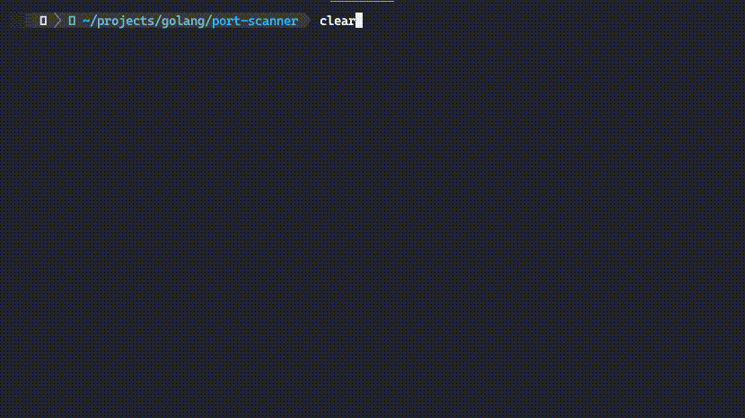

# PortPeak


This project is a simple port scanner written in Go. It uses Go's concurrency features to efficiently scan for open ports on a given IP address and displays the results in a table format.

## Features

- Scans ports within a specified range
- Uses Go's concurrency to speed up the scanning process
- Displays open ports in a nicely formatted table

## Prerequisites

- Go 1.16 or later

## Installation

1. Clone the repository:
   ```sh
   git clone https://github.com/RoshanShrestha123/port-peek
   cd port-peek
   ```

2. Install the required dependencies:
   ```sh
   go install
   ```

3. Build the project:
   ```sh
   go build -o port-peek
   ```

## Usage

Run the port scanner with the target IP address and port range:

```sh
./port-peek -ip <IP_ADDRESS> -startPort <START_PORT> -endPort <END_PORT>
```

Example:

```sh
./port-peek -ip 192.168.1.1 -startPort 1 -endPort 5000
```

## Example Output

```
---Searching for OPEN port---
+------+---------+--------+
| PORT | NETWORK | STATUS |
+------+---------+--------+
|  22  |  tcp    |  open  |
|  80  |  tcp    |  open  |
| 443  |  tcp    |  open  |
+------+---------+--------+
Done
```




## Contributing

1. Fork the repository
2. Create your feature branch (`git checkout -b feature/your-feature`)
3. Commit your changes (`git commit -am 'Add some feature'`)
4. Push to the branch (`git push origin feature/your-feature`)
5. Create a new Pull Request

